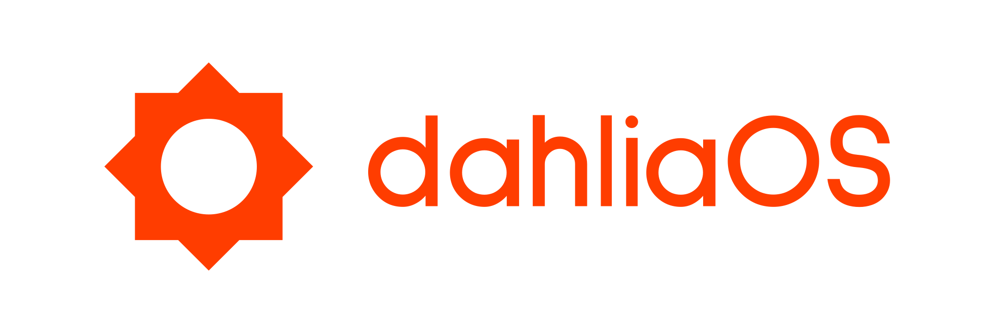

# Official dahliaOS brand assets

The dahliaOS brand is unique and it belongs to the dahliaOS organization.

## Logo and Banner

dahliaOS claims two marks: the “dahliaOS” logo and the “dahliaOS” banner.

Both should be used with the following in mind:

* Do not stretch, skew, rotate, flip, or otherwise alter the mark.

* Do not attempt to recreate the logo or banner.

The logotype/logomark should always be as they are unless they are:

* on a white background, then use the version of the logotype/logomark with the drop shadow.
## Logo

<ul align="center">
  
  

The “dahliaOS” logomark is to be used to refer to dahliaOS when there is not enough space for the full logotype or a square ratio is required.

## Banner

  
  
  

The logotype is to be used when space allows to refer to dahliaOS, or it can be used before a product name to refer to a specific app/service of dahliaOS.

## Project and product names

dahliaOS is always lower-case, even when beginning sentences.
It can also be used along with product names (for example, “dahliaOS App Store”) to refer to a specific application/service.

## Fonts

Brand: Sulphur Point
Interface: Inter
Website: Roboto

## 3rd parties and community

We kindly ask third-party developers creating apps/designs for dahliaOS to adopt certain elements of the dahliaOS brand for consistency:

* Fonts.

However, we restrict the usage of the dahliaOS name and marks:

* You are encouraged to say that your app or service is “designed for dahliaOS,” but do not use the dahliaOS name or marks as part of the name of your company, application, product, or service—or in any logo you create.

* Only use the dahliaOS name or marks to refer to dahliaOS or its products.

## License

  
  

Copyright @ 2019-2022 - The dahliaOS Authors - contact@dahliaos.io

This project is licensed under the [Apache 2.0 license](/LICENSE)
